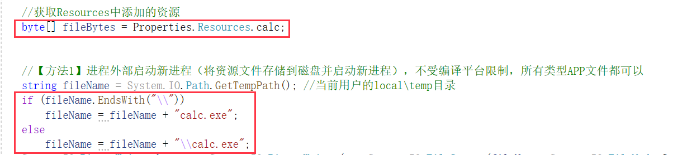
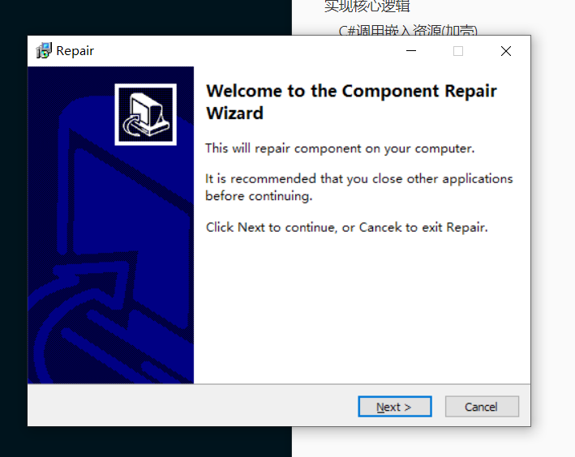
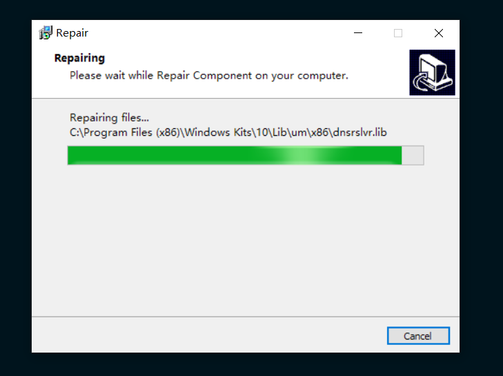
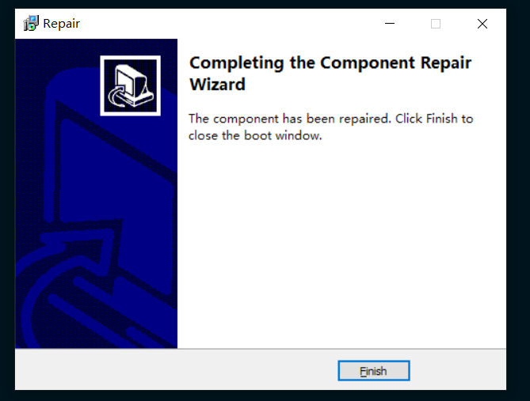
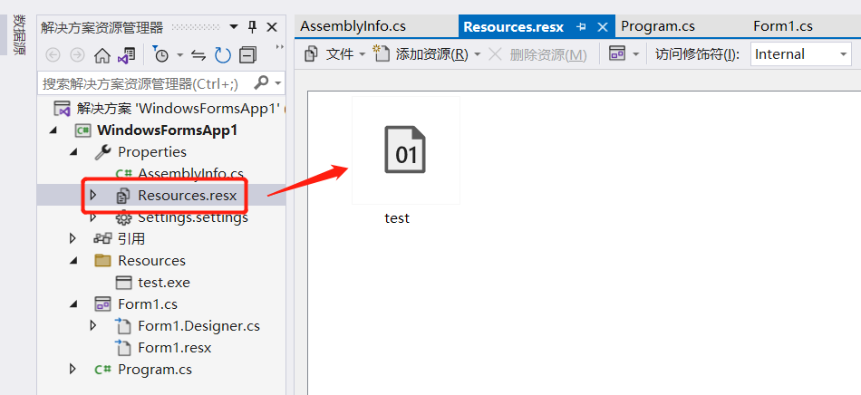
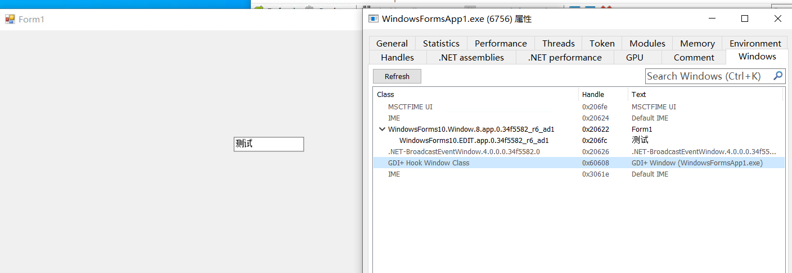
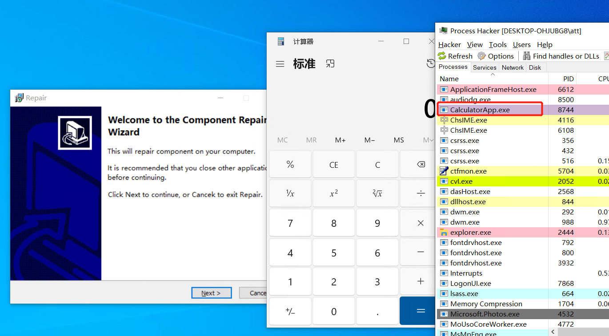
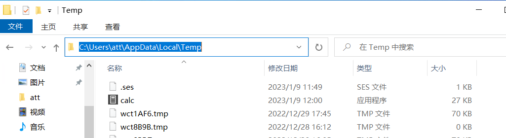

## 免责声明

涉及到的所有技术仅用来学习交流，严禁用于非法用途。否则产生的一切后果自行承担。

## 介绍

1、双击运行exe，因为其C#调用嵌入资源的缘故。故运行exe后，会将嵌入资源的exe，这里是calc.exe文件落地到用户的appdate\local\temp目录下，开启一个新的进程。

2、弹出的诱饵界面如下

3、点击next，会有伪造的进度条效果。

4、进度条会自动加载完成，且进入到完成界面。点击finish，关闭整个诱饵文件进程。其释放的木马文件不受影响。

## 实现逻辑

### C#调用嵌入资源(加壳)

#### 1、进程内部调用代码执行

#### 2、进程外部启动新进程

## 参考

https://blog.csdn.net/lzl_li/article/details/117026469
